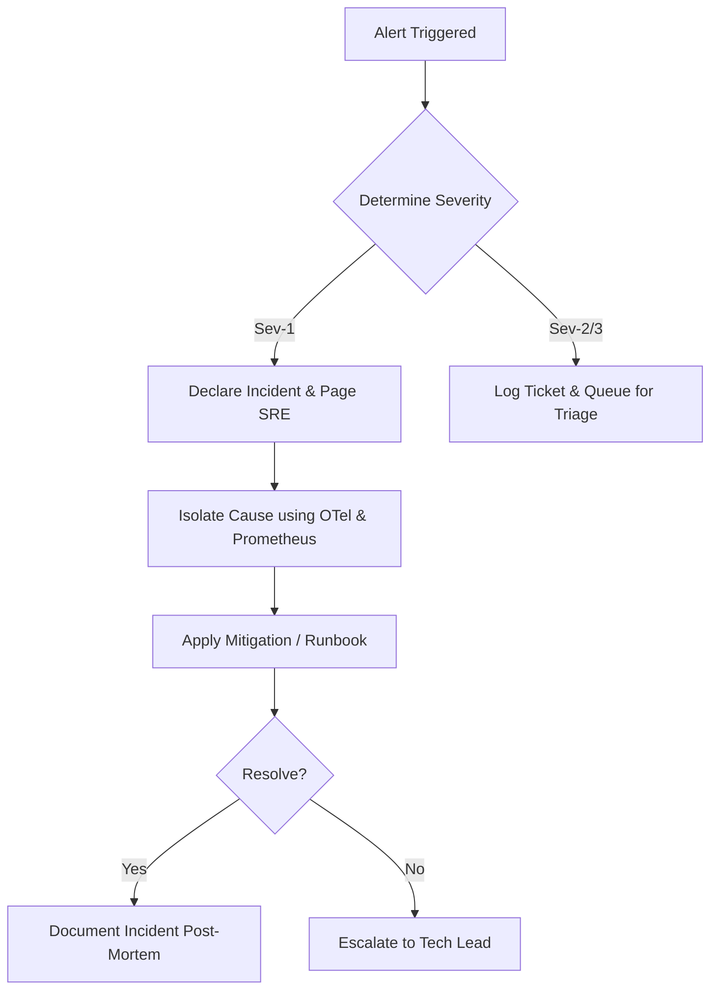

# LifeOS AI – Incident Response & Triage Guidelines

This document provides a framework for identifying, triaging, and resolving critical production outages.

---

## 1. Incident Severity Definitions

| Severity | Impact | Targets / Examples | Response Window |
| :--- | :--- | :--- | :--- |
| **Sev-1 (Critical)** | Core service unavailable for all users | DB connection offline, auth system failure, major data corruption | Immediate (Page SRE) |
| **Sev-2 (Major)** | Major features degraded; partial outage | AI assistant failover routing failure, notification worker backlogs | Under 4 hours |
| **Sev-3 (Minor)** | Non-critical bug; cosmetic issue | Dashboard charting alignment, formatting issues | Next business sprint |

---

## 2. Step-by-Step Triage Flow

### Step 1: Identification & Declaration
- When a Sev-1 alert is triggered (e.g., Prometheus raises database failure alert), the on-call engineer declares an incident in the Slack channels (#incident-response).

### Step 2: Isolation
- Check `/api/health` status.
- Audit Grafana dashboard panels.
- Inspect OpenTelemetry trace streams in Tempo to pinpoint the failing database, Redis cache, or third-party API provider.

### Step 3: Mitigation
- Execute the matching playbook from `docs/runbooks.md`.
- Deploy hotfixes if necessary.

### Step 4: Resolution & Post-Mortem
- Close the incident once `/api/health` returns `healthy` status and metrics return to baseline.
- Draft a post-mortem documenting:
  - Root Cause Analysis (RCA)
  - Time to Identify (TTI)
  - Time to Resolve (TTR)
  - Follow-up preventive action items.
